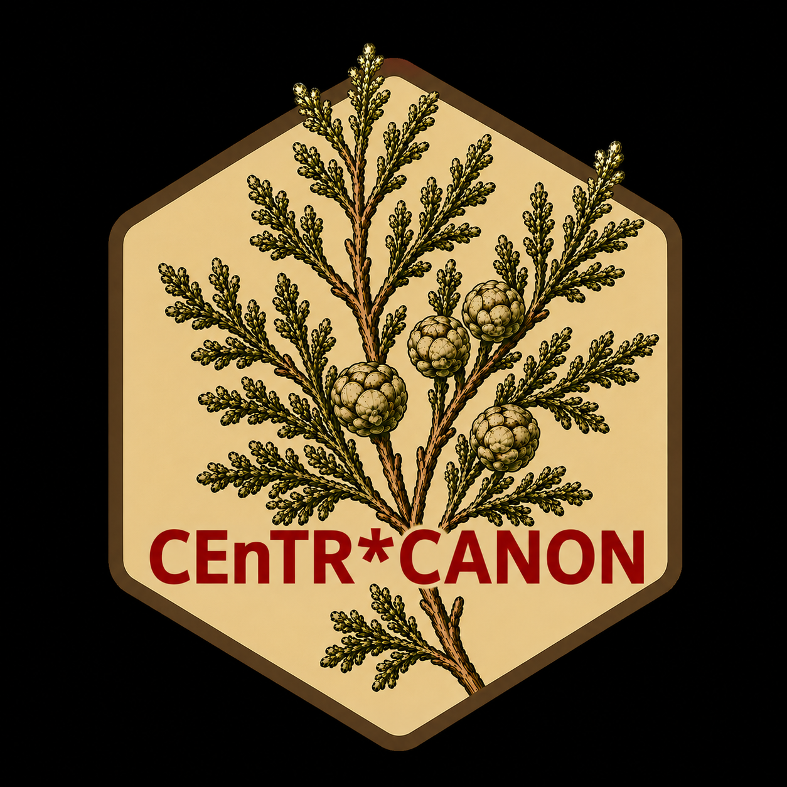

# centrcanon 

<!-- badges: start -->
[](https://github.com/centrcanon/centrcanon/actions/workflows/R-CMD-check.yaml)
[](https://opensource.org/licenses/MIT)
<!-- badges: end -->

`centrcanon` is the analytical engine for **CEnTR\*MAP** — a workflow that
supports institutions and communities in collaboratively constructing a **local
definition of community-engaged research (CEnR)**.

The package does not produce a definition. It surfaces the underlying structure
of how a community of scholars talks about their work — identifying which
concepts are most central, best connected, and most influential. Those scores
guide practitioners in organizing and prioritizing terms into a
locally-grounded, community-constructed definition.

## The three pipelines

| Pipeline | Question answered | Output |
|---|---|---|
| **Anchoring** | Which concepts are most central to how this community describes CEnR? | `anchoring_score` |
| **Integration** | Which concepts serve as structural connectors across the network? | `integration_score` |
| **Leverage** | Which concepts hold the most influence in shaping the field? | `leverage_score` |

Together, high scores across all three pipelines identify the strongest
candidates for inclusion in a local CEnR definition. PAM clusters and network
communities suggest how terms can be grouped into coherent themes.

## Installation

```r
# Install from GitHub
remotes::install_github("centrcanon/centrcanon")
```

## Quick start

All three pipelines share a single input: an **edgelist** tibble with columns
`group`, `from`, and `to`. The source data typically uses `hex1`/`hex2` for the
concept pair columns — rename them before passing to any package function.

```r
library(dplyr)
library(centrcanon)

edgelist <- raw |>
  rename(from = hex1, to = hex2) |>
  select(group, from, to) |>
  filter(!is.na(from), !is.na(to))
```

### Pipeline 1 — Anchoring

```r
ct        <- prepare_contingency_table(edgelist)
ca        <- run_correspondence_analysis(ct)
pam       <- run_pam_clustering(ca, k = 6L)
anchoring <- calculate_anchoring_score(ca, pam$clustering)
```

### Pipeline 2 — Integration

```r
g           <- create_network(edgelist)
metrics     <- calculate_network_metrics(g)
integration <- calculate_integration_score(metrics)
```

### Pipeline 3 — Leverage

```r
leverage <- calculate_leverage_score(metrics)
leverage |> select(name, node_role, leverage_score, tier)
```

Each node is classified into one of eleven roles — from `"Core Keystone"` (high
across all three centrality dimensions) down to `"Non-Key"` — based on how its
eigenvector, communicability betweenness, and Katz centrality compare to the
rest of the network.

## Color palettes

Two palettes are included for use in downstream visualizations:

```r
centr_earthtone_palette()  # 8-color earthtone palette for cluster/role coloring
centr_layer_palette()      # anchoring / integration / leverage base colors
```

## Learn more

- [Full vignette](https://centrcanon.github.io/centrcanon/articles/centr-pipeline.html) — end-to-end pipeline walkthrough
- [Function reference](https://centrcanon.github.io/centrcanon/reference/) — complete API docs

## Note on reproducibility

`centrcanon` never calls `set.seed()`. If you need reproducible PAM clustering
or community detection results, call `set.seed()` in your own script before
running the pipeline.

## License

MIT © Jeremy Price
